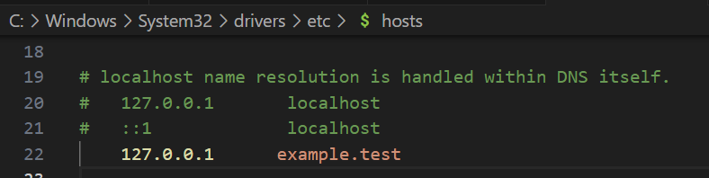

# Virtual Host Documentation

## Overview

A virtual host is a method of hosting multiple domain names (or websites) on a single server. This is achieved by directing the incoming web traffic to different directories or locations on the server, based on the domain name requested by the user.

## Technology Used

- PHP 8.1.17
- MySQL
- XAMPP (Apache)

## Prerequisites

Before you begin, ensure you have the following installed:

- [XAMPP](https://www.apachefriends.org/index.html)
- Web browser (e.g., Chrome, Firefox)

## For Configuring Virtual Host
1. firstly, create a file on the web server's root directory (e.g., htdocs in XAMPP) with required extention (e. g., .php/.html).
2. If you are using XAMPP on Windows, the httpd-vhosts.conf file is typically located in the apache\conf\extra directory within your XAMPP installation. For example, C:\xampp\apache\conf\extra\httpd-vhosts.conf. Open this file in the editor with administrative permission. then add the following instructions.
      <VirtualHost *:80>
         DocumentRoot "C:/xampp/htdocs/folder_name/file_name.php"
         ServerName mywebsite.com
      </VirtualHost>
3. with administrator privileges, edit the 'C:\Windows\System32\drivers\etc\hosts' file using the following instructions.
      127.0.0.1      mywebsite.com
4. Restart the apache server on Xampp.
5. You've successfully set up virtual hosts on your server. you can use 'mywebsite.com' url to run your website.

## Demo

